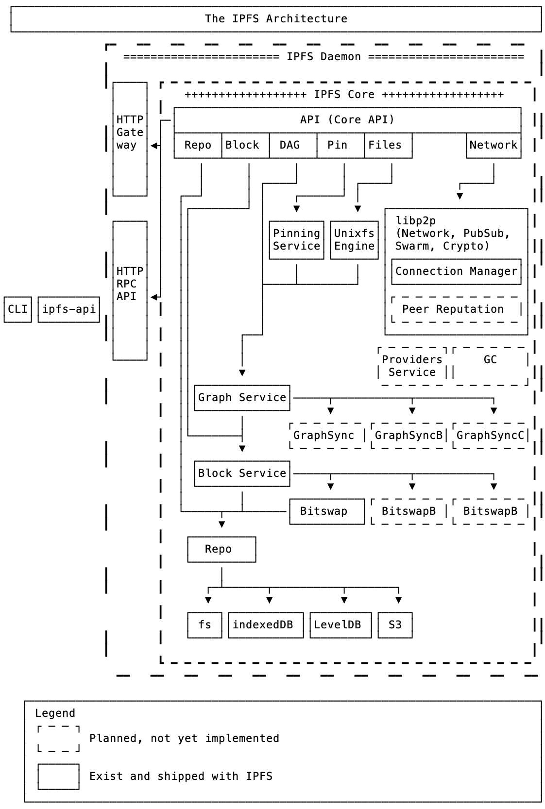

# `js-ipfs` Examples and Tutorials

In this folder and on [ProtoSchool](https://proto.school), you can find a variety of examples to help you get started with js-ipfs, in Node.js and in the Browser. Every example has a specific purpose and some of them incorporate a full tutorial that you can follow through, helping you expand your knowledge about IPFS and the Distributed Web in general.

Let us know if you find any issue or if you want to contribute and add a new tutorial, feel welcome to submit a PR, thank you!

## Tutorials

### On ProtoSchool
[ProtoSchool](https://proto.school) offers tutorials on decentralized web protocols, through both [interactive tutorials](https://proto.school/#/tutorials) and [local chapter events](https://proto.school/#/chapters). These IPFS tutorials use js-ipfs in the browser:
- [Mutable File System (MFS)](https://proto.school/#/mutable-file-system/) - Explores the Files API, which lets you work with files and directories as if you were using a traditional name-based file system.
- [P2P Data links with content addressing](https://proto.school/#/basics/) - An introductory look at the DAG API.
- [Blogging on the Decentralized Web](https://proto.school/#/blog/) - An intermediate DAG API challenge using CIDs to link complex data structures.

### In this repo
Clone this repo to explore these tutorials on your local machine:
- [Tutorial: IPFS 101, spawn a node and add a file to IPFS](./ipfs-101)
- [Tutorial: Build a tiny browser app to exchange files between nodes](./exchange-files-in-browser)
- [Tutorial: Resolve through IPLD graphs with the dag API](./traverse-ipld-graphs)
- [Tutorial: Use IPFS to explore the Ethereum BlockChain](./explore-ethereum-blockchain)
- [Tutorial (Video): How to build an application with IPFS PubSub Room](https://www.youtube.com/watch?v=Nv_Teb--1zg)
- [Tutorial (Video): How to build an Collaborative Editing Application with IPFS using CRDT](https://www.youtube.com/watch?v=-kdx8rJd8rQ)
- [Tutorial - Understanding Circuit Relay](./circuit-relaying)

## Examples

- [js-ipfs in the browser with Browserify](./browser-browserify)
- [js-ipfs in the browser with Parcel.js](./browser-parceljs)
- [js-ipfs in the browser with Vue](./browser-vue)
- [js-ipfs in the browser with WebPack](./browser-webpack)
- [js-ipfs in the browser with a `<script>` tag](./browser-script-tag)
- [js-ipfs in electron](./run-in-electron)
- [Using streams to add a directory of files to ipfs](./browser-add-readable-stream)
- [Customizing the ipfs repository](./custom-ipfs-repo)
- [Customizing your libp2p bundle](./custom-libp2p)
- [Streaming video from ipfs to the browser using `ReadableStream`s](./browser-readablestream)
- [The Mutable File System in the browser](./browser-mfs)

## Understanding the IPFS Stack

In this section, you will find explanations to different pieces of IPFS Architecture and how `js-ipfs` implements them.

[Annotated version](https://user-images.githubusercontent.com/1211152/47606420-b6265780-da13-11e8-923b-b365a8534e0e.png)

> These explanations are still a work in progress

- Storing and Retrieving blocks (soon™)
- IPLD (InterPlanetary Linked-Data) (soon™)
- IPFS Networking - Managing your swarm, libp2p and more (soon™)
