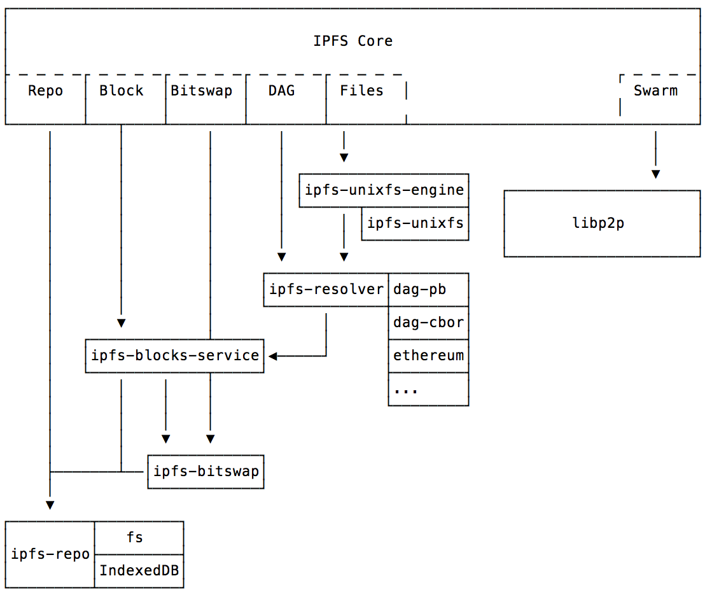

# `js-ipfs` Examples and Tutorials

In this folder, you can find a variety of examples to help you get started in using js-ipfs, in Node.js and in the Browser. Every example has a specific purpose and some of each incorporate a full tutorial that you can follow through, helping you expand your knowledge about IPFS and the Distributed Web in General.

Let us know if you find any issue or if you want to contribute and add a new tutorial, feel welcome to submit a PR, thank you!

## Tutorials

- [Tutorial: IPFS 101, spawn a node and add a file to IPFS](./ipfs-101)
- [Tutorial: Build a tiny browser app to exchange files between nodes](./exchange-files-in-browser)
- [Tutorial: Interact with IPFS directly from your Terminal](./ipfs-cli-fun)
- [Tutorial: Resolve through IPLD graphs with the dag API](./traverse-ipld-graphs)
- [Tutorial: Use IPFS to explore the Ethereum BlockChain](./explore-ethereum-blockchain)
- [Tutorial: How to build an application with IPFS PubSub Room](https://www.youtube.com/watch?v=Nv_Teb--1zg)
- [Tutorial: How to build an Collaborative Editing Application with IPFS using CRDT](https://www.youtube.com/watch?v=-kdx8rJd8rQ)

## Examples

- [js-ipfs in the browser with Browserify](./browser-browserify)
- [js-ipfs in the browser with WebPack](./browser-webpack)
- [js-ipfs in the browser with a `<script>` tag](./browser-script-tag)
- [js-ipfs in electron](./run-in-electron)

## Understanding the IPFS Stack

In this section, you will find explanations to different pieces of IPFS Architecture and how `js-ipfs` implements them.

> These explanations are still a work in progress

- Storing and Retrieving blocks (soon™)
- IPLD (InterPlanetary Linked-Data) (soon™)
- IPFS Networking - Managing your swarm, libp2p and more (soon™)
