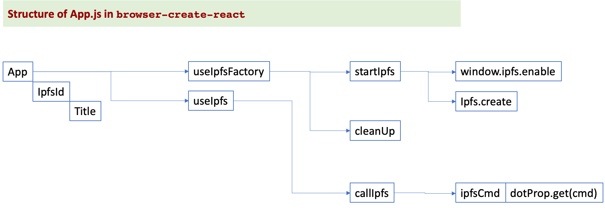

## IPFS React app

A minimal demonstration of how to use js-ipfs in a `create-react-app` generated app.

It boots up a js-ipfs instance (an IPFS node) via a custom React hook in `./src/hooks/use-ipfs-factory.js`, which is called from `./src/App.js`. Once the IPFS node is set up, `App.js` displays its ident  and its version number.


This project was bootstrapped with [Create React App](https://github.com/facebook/create-react-app). **v2.1.3**. It has been tested with `node` **v12.18.4** (`npm` **v6.14.6**) and `node` **v14.17.0** (`npm` **v7.13.0****)

**Note**: this example is useful to learn how to spawn IPFS from a web page, but this is not the best way to use IPFS because it will spawn an IPFS daemon regardless of whether there is already another daemon running on the same computer. See https://github.com/ipfs/in-web-browsers/issues/158. For pragmatic uses, you may want to call directly the IPFS node run by Infura, see tutorial at https://github.com/kvutien/ipfs-dapp.

## To start

First clone the whole repo, install dependencies limited to this project `browser-create-react-app` and run the demo.

```console
$ git clone https://github.com/ipfs/js-ipfs.git
$ cd js-ipfs/examples/browser-create-react-app
$ npm install
$ npm start
```
## Call structure in `App.js`
All React applications store their main logic in `App.js`. For this demo, the calling sequence of `App.js` is 
* `App.js` renders the cosmetics of the demo
* `useIpfsFactory.js` initialises and closes the IPFS daemon 
* `useIpfs.js` does the actual calls to IPFS

## Annexes
### Console message `[HMR] Waiting for update signal from WDS...`

This message comes from the hot reload capability of webpack, that can update the web app every time you save your development code. To remove it, see here: https://stackoverflow.com/questions/59695102/reactjs-console-error-hmr-waiting-for-update-signal-from-wds

### Available Scripts from create-react-app

In the project directory, you can run:

#### `npm start`

Runs the app in the development mode.<br>
Open [http://localhost:3000](http://localhost:3000) to view it in the browser.

The page will reload if you make edits.<br>
You will also see any lint errors in the console.

#### `npm test`

Launches the test runner in the interactive watch mode.<br>
See the section about [running tests](https://facebook.github.io/create-react-app/docs/running-tests) for more information.

#### `npm run build`

Builds the app for production to the `build` folder.<br>
It correctly bundles React in production mode and optimizes the build for the best performance.

The build is minified and the filenames include the hashes.<br>
Your app is ready to be deployed! For example drag-and-dropped in the Netlify manual installation page.

But with modern hosting services like Heroku, Netlity or Fleek, you can skip the build because they will do a complete github deployment for you. See the section about [deployment](https://facebook.github.io/create-react-app/docs/deployment) for more information.


## Learn More

You can learn more on IPFS API in the [IPFS documentation](https://docs.ipfs.io/) and [IPFS npm documentation](https://www.npmjs.com/package/ipfs-http-client).

Details how to use the File System abstraction of IPFS (add, cat, egt, ls etc.) are [here](https://github.com/ipfs/js-ipfs/blob/master/docs/core-api/FILES.md)

To have a high level view of IPFS, check out the [ConsenSys blog](https://medium.com/@ConsenSys/an-introduction-to-ipfs-9bba4860abd0).

