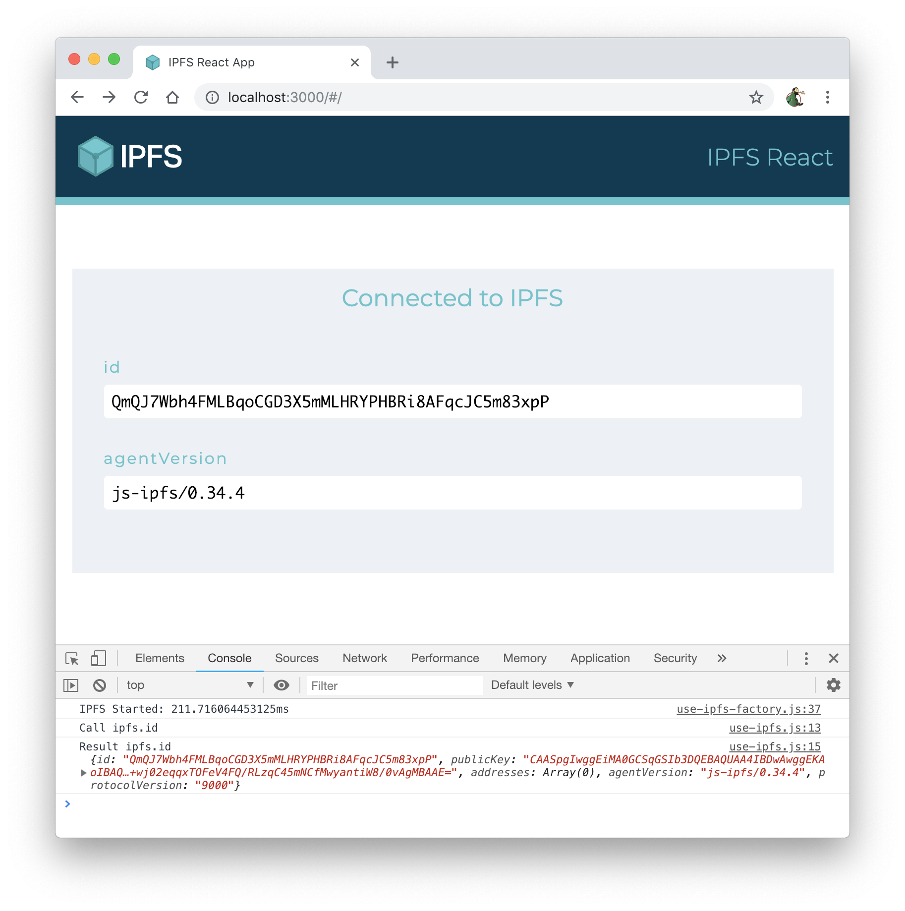

## IPFS React app

A minimal demonstration of how to use js-ipfs in a `create-react-app` generated app.

It boots up a js-ipfs instance (an IPFS node) via a custom React hook in `./src/hooks/use-ipfs-factory.js`, which is called from `./src/App.js`. Once the IPFS node is set up, `App.js` displays its ident and its version number.

> _Remember that a Peer ID of an IPFS node is [the multihash of the public key of this node](https://github.com/libp2p/specs/blob/master/peer-ids/peer-ids.md#peer-ids), and the public-private key pair of a node is generated by typing `ipfs init`._




**Note**: this example is useful to learn how to spawn IPFS from a web page. It is also possible to [spawn an IPFS daemon from the command line](https://docs.ipfs.io/install/command-line/) with `ipfs daemon`.  While self-hosting is advised, one can also delegate IPFS operations to a third-party like Infura. See tutorials [here](https://blog.infura.io/part-2-getting-started-with-ipfs-on-infura/) and [here](https://blog.infura.io/part-2-getting-started-with-ipfs-on-infura/).

## To start

First clone the whole repo, install dependencies limited to this project `browser-create-react-app` and run the demo.

```console
$ git clone https://github.com/ipfs/js-ipfs.git
$ cd js-ipfs/examples/browser-create-react-app
$ npm install
$ npm start
```
## Call structure in `App.js`
All React applications store their main logic in `App.js`:
* `App.js` renders the cosmetics of the demo and call `useIpfs` to retrieve the `id` of the node
* `useIpfsFactory.js` initialises and closes the IPFS local node
* `useIpfs.js` does the actual calls to IPFS to retrieve the property specified in argument (here the retrieved property is `id`, requested from `App.js`)

## Annexes
### Console message `[HMR] Waiting for update signal from WDS...`

This message comes from the hot reload capability of webpack, that can update the web app every time you save your development code. To remove it, see here: https://stackoverflow.com/questions/59695102/reactjs-console-error-hmr-waiting-for-update-signal-from-wds

### Available Scripts from create-react-app

In the project directory, you can run:

#### `npm start`

Runs the app in the development mode.<br>
Open [http://localhost:3000](http://localhost:3000) to view it in the browser.

The page will reload if you make edits.<br>
You will also see any lint errors in the console.

#### `npm test`

Launches the test runner in the interactive watch mode.<br>
See the section about [running tests](https://facebook.github.io/create-react-app/docs/running-tests) for more information.

#### `npm run build`

Builds the app for production to the `build` folder.<br>
It correctly bundles React in production mode and optimizes the build for the best performance.

The build is minified and the filenames include the hashes.<br>
Your app is ready to be deployed! Read how to host a [single page](https://docs.ipfs.io/how-to/websites-on-ipfs/single-page-website/) or an [entire website](https://docs.ipfs.io/how-to/websites-on-ipfs/multipage-website/#prerequisites) on IPFS.

But with modern hosting services like Heroku, Netlity or Fleek, you can skip the build because they will do a complete github deployment for you. See the React official page about [deployment](https://facebook.github.io/create-react-app/docs/deployment) for more information.


## Learn More

You can learn more on IPFS API in the [IPFS documentation](https://docs.ipfs.io/) and [IPFS npm documentation](https://www.npmjs.com/package/ipfs-http-client).

Details how to use the File System abstraction of IPFS (add, cat, egt, ls etc.) are [here](https://github.com/ipfs/js-ipfs/blob/master/docs/core-api/FILES.md)

