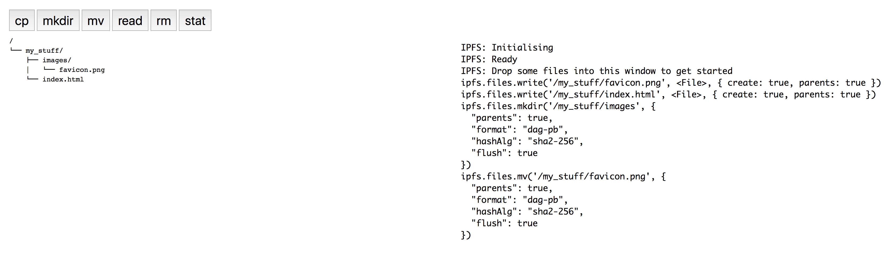
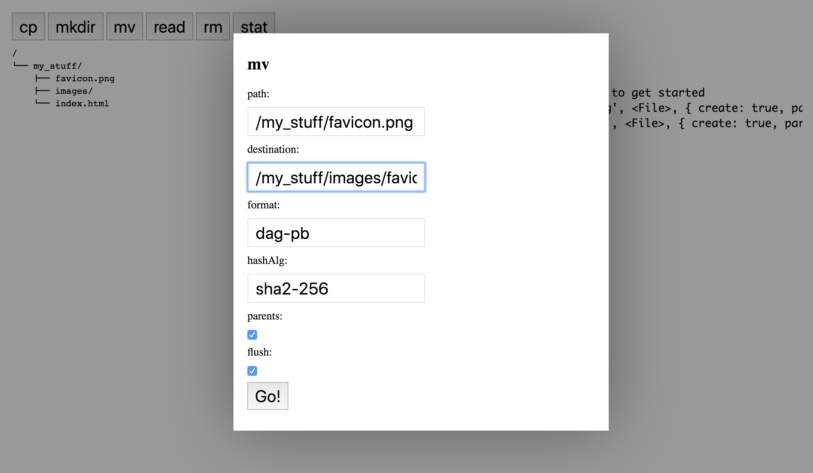

# Mutable File System examples

The MFS is a file system abstraction built on top of IPFS.  It supports all the operations you would expect such as creating directories, adding files to them, renaming, coping, deleting, etc.

This demo allows you to upload files from your computer and use them to explore MFS methods from within your web browser.





## Before you start

First clone this repo, install dependencies in the project root and build the project.

```console
$ git clone https://github.com/ipfs/js-ipfs.git
$ cd js-ipfs
$ npm install
$ npm run build
```

## Running the example

Navigate into this directory:

```
$ cd js-ipfs/examples/browser-mfs
```

In this directory run:

```
$ npm start
```

Then open [http://localhost:8888](http://localhost:8888) in your browser.
