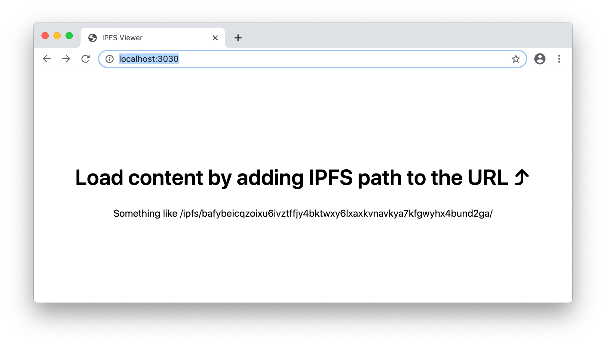
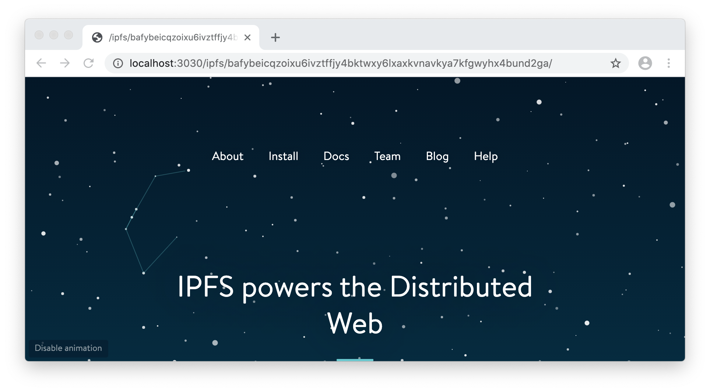

# Using js-ipfs node in [SharedWorker][] from [ServiceWorker][]

> In this example, you will find boilerplate code you can use to set up an IPFS
> node in a [SharedWorker][] and use it from a [ServiceWorker][].

## General Overview

### `src/main.js`

Module is loaded in the main thread (DOM window) and is responsible for wiring
all the pieces together:

1. Activates a [SharedWorker][] that runs an IPFS node.
2. Registers a [ServiceWorker][] to serve IPFS content from.
3. Listens to [MessagePort][] requests from the [ServiceWorker][] and responds
   back with a [MessagePort][] of the [SharedWorker][], enabling
   it to interact with shaerd IPFS node.

### `src/worker.js`

Module is loaded in the [SharedWorker][]. It demonstrates how to setup the IPFS
node such that it can be used in other browsing contexts.

### `src/service.js`

Module is loaded in the [ServiceWorker][] and responds to all the requests from
the page. It recognizes four different request routes:

1. Routes `/ipfs/...`, `/ipns/...` are served html pages that:

  - Contain a full page iframe that has an `src` derived from request path e.g.:

   ```
   /ipfs/Qm...hash/file/name -> /view/Qm...hash/file/name
   ```
  - `src/main.js` script loaded in it.
  
  This way when request from `/view/Qm..hash/file/name` arrives [ServiceWorker][]
  can obtain a [MessagePort][] for the [SharedWorker][] by requesting it from
  the iframe container.

2. Routes `/view/ipfs/...` and  are served corresponding content from IPFS. On
   such request message is send to an iframe container (That is why `/ipfs/...`
   and `/ipns/...` routes served `iframe` and `src/main.js`), through which
   [MessagePort][] for the [SharedWorker][] is obtained and used to retrieve
   content from the shared IPFS node and served back.

   > There is a stub for `/view/ipns/...` route, which is left as an excercise
   > for the reader to fill.

3. All other routes are served by fetchging it from the network.


## Before you start

First clone this repo, cd into the example directory and install the dependencies

```bash
git clone https://github.com/ipfs/js-ipfs.git
cd js-ipfs/examples/browser-service-worker
npm install
```

## Running the example

Run the following command within this folder:

```bash
npm start
```

Now open your browser at `http://localhost:3000`

You should see the following:



If you navigate to the following address `http://localhost:3000/ipfs/bafybeicqzoixu6ivztffjy4bktwxy6lxaxkvnavkya7kfgwyhx4bund2ga/` it should load a
page from ipfs and appear as:



### Run tests

```bash
npm test
```


[SharedWorker]:https://developer.mozilla.org/en-US/docs/Web/API/SharedWorker
[ServiceWorker]:https://developer.mozilla.org/en-US/docs/Web/API/Service_Worker_API
[MessagePort]:https://developer.mozilla.org/en-US/docs/Web/API/MessagePort
