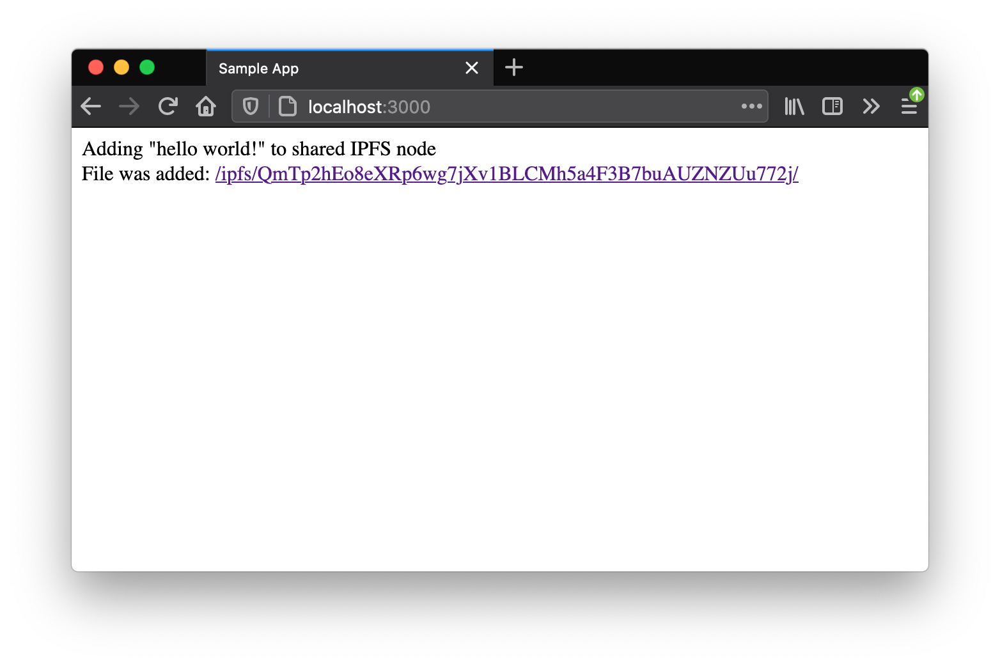

# Sharing js-ipfs node across browsing contexts (tabs) using [SharedWorker][]

> In this example, you will find a boilerplate you can use to set up a js-ipfs
> node in the [SharedWorker] and use it from multiple tabs.

## Before you start

First clone this repo, install dependencies in the project root and build the project.

```bash
git clone https://github.com/ipfs/js-ipfs.git
cd js-ipfs/examples/browser-sharing-node-across-tabs
npm install
```

## Running the example

Run the following command within this folder:

```bash
npm start
```

Now open your browser at `http://localhost:3000`

You should see the following:




### Run tests

```bash
npm test
```


[SharedWorker]:https://developer.mozilla.org/en-US/docs/Web/API/SharedWorker