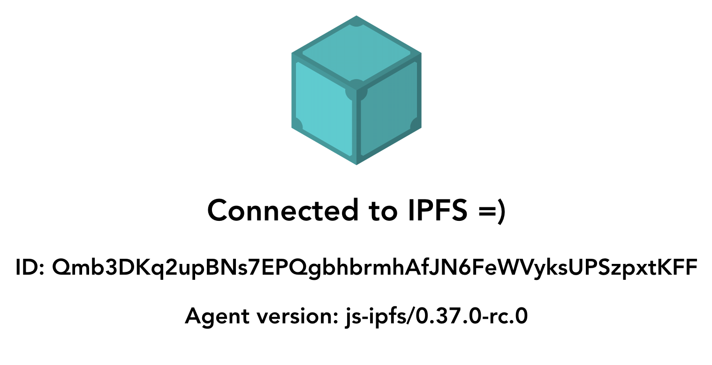

# IPFS Vue app

A minimal demonstration of how to use `js-ipfs` with `Vue`.



This project was bootstrapped with [Vue CLI](https://cli.vuejs.org/).

## Project setup

```bash
npm install
```

### Compiles and hot-reloads for development

```bash
npm run serve
```

### Compiles and minifies for production

```bash
npm run build
```

### Run your tests

```bash
npm run test
```

### Lints and fixes files

```bash
npm run lint
```

### Customize configuration

See [Configuration Reference](https://cli.vuejs.org/config/).
