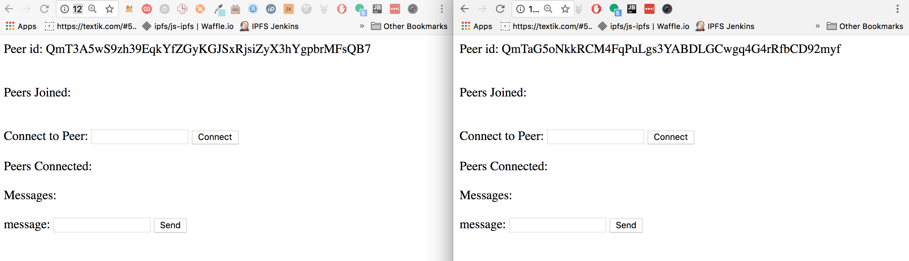

# Tutorial - Understanding Circuit Relay

> Welcome! This tutorial will help you understand circuit relay, where it fits in the stack and how to use it.

### So what is a `circuit-relay` and what do we need it for?

In p2p networks there are many cases where two nodes can't talk to each other directly. That may happen because of network topology, i.e. NATs, or execution environments - for example browser nodes can't connect to each other directly because they lack any sort of socket functionality and relaying on specialized rendezvous nodes introduces an undesirable centralization point to the network. A `circuit-relay` is a way to solve this problem - it is a node that allows two other nodes that can't otherwise talk to each other, use a third node, a relay to do so.

#### A word on circuit relay addresses

A circuit relay address is a multiaddress that describes how to either connect to a peer over a relay (or relays), or allow a peer to announce it is reachable over a particular relay or any relay it is already connected to. 

Circuit relay addresses are very flexible and can describe many different aspects of how to esablish the relayed connection. In its simplest form, it looks something like this:

- `/p2p-circuit/ipfs/QmPerr`

If we want to be specific as to which transport we want to use to establish the relay, we can encode that in the address as well:

- `/ip4/127.0.0.1/tcp/65000/ipfs/QmRelay/p2p-circuit/ipfs/QmPeer`

This tells us that we want to use `QmRelay` located at address 127.0.0.1 and port 65000.

- `/ip4/127.0.0.1/tcp/65000/ipfs/QmRelay/p2p-circuit/ip4/127.0.0.1/tcp/8080/ws/ipfs/QmPeer`

We can take it a step further and encode the same information for the destination peer. In this case, we have it located at 127.0.0.1 on port 8080 and using a Web sockets transport!

Other use-cases are also supported by this scheme, i.e. we can have multiple hops (circuit-relay nodes) encoded in the address, something planed for future releases.

## Step-by-step instructions

Here's what we are going to be doing, today:

- 1. Install and configure `go-ipfs` and `js-ipfs` nodes
- 2. Configure and run the js or go ipfs node
- 3. Configure and run the bundled example
- 4. Connect the two browser nodes to the circuit relay
- 5. Dial the two browser nodes using a `/p2p-circuit` address
- 6. Finally, send data from one browser using the bundled example!

Let's go.

### 1. Set up

You'll need to have an implementation of IPFS running on your machine. Currently, this means either go-ipfs or js-ipfs.

Installing go-ipfs can be done by installing the binary [here](https://ipfs.io/ipns/dist.ipfs.io/#go-ipfs). Alternatively, you could follow the instructions in the README at [ipfs/go-ipfs](https://github.com/ipfs/go-ipfs).

Installing js-ipfs requires you to have node and [npm](https://www.npmjs.com). Then, you simply run:

```sh
> npm install --global ipfs
...
> jsipfs --help
Commands:
...
```

This will alias `jsipfs` on your machine; this is to avoid issues with `go-ipfs` being called `ipfs`.

At this point, you have either js-ipfs or go-ipfs running. Now, initialize it:

```sh
> ipfs init
# or
> jsipfs init
```

This will set up your IPFS repo in your home directory.

#### Configure and run the js or go ipfs node

We can either use a `go-ipfs` or a `js-ipfs` node as a relay, we'll demonstrate how to set them up in this tutorial and we encourage you to try them both out. That said, either js or go should do the trick for the purpose of this tutorial!

##### Setting up a `go-ipfs` node

In order to enable the relay functionality in `go-ipfs` we need to edit it's configuration file, located under `~/.ipfs/config`:

```js
  "Swarm": {
    "AddrFilters": null,
    "ConnMgr": {
      "GracePeriod": "20s",
      "HighWater": 900,
      "LowWater": 600,
      "Type": "basic"
    },
    "DisableBandwidthMetrics": false,
    "DisableNatPortMap": false,
    "DisableRelay": false,
    "EnableRelayHop": true
  }
```

The two options we're looking for are `DisableRelay` and `EnableRelayHop`. We want the former (`DisableRelay`) set to `false` and the later (`EnableRelayHop`) to `true`, just like in the example above. That should set our go node as a relay!

##### Setting up a `js-ipfs` node

In order to do the same in `js-ipfs` we need to do something similar, however the config options are slightly different right now, that should change once this feature is not marked as experimental, but for now we have to deal with two different set of config options. Lets do this! Just as we did with `go-ipfs`, go ahead and edit `js-ipfs` config file located under `~/.jsipfs/config`, under the `EXPERIMENTAL` section. Lets add the following config:

(Note that the "EXPERIMENTAL" section might not be present in the config file, in that case, just go ahead and add it)

```js
  "EXPERIMENTAL": {
    "relay": {
      "enabled": true,
      "hop": {
        "enabled": true
      }
    }
  }
```

Again, that will make our `js-ipfs` node a relay node! Exciting!

##### Starting the relay node

We can start the relay nodes by either doing `ipfs daemon` or `jsipfs daemon`, that should start our previously installed go or js nodes. We should see an output similar to the bellow one:

```js
Initializing daemon...
Swarm listening on /p2p-circuit/ipfs/QmQR1DQNhDxsrk78ads6ccb8nDUG77c5tGK95HiXwQKUuV
Swarm listening on /p2p-circuit/ip4/0.0.0.0/tcp/4002/ipfs/QmQR1DQNhDxsrk78ads6ccb8nDUG77c5tGK95HiXwQKUuV
Swarm listening on /p2p-circuit/ip4/127.0.0.1/tcp/4003/ws/ipfs/QmQR1DQNhDxsrk78ads6ccb8nDUG77c5tGK95HiXwQKUuV
Swarm listening on /ip4/127.0.0.1/tcp/4003/ws/ipfs/QmQR1DQNhDxsrk78ads6ccb8nDUG77c5tGK95HiXwQKUuV
Swarm listening on /ip4/127.0.0.1/tcp/4002/ipfs/QmQR1DQNhDxsrk78ads6ccb8nDUG77c5tGK95HiXwQKUuV
Swarm listening on /ip4/192.168.1.132/tcp/4002/ipfs/QmQR1DQNhDxsrk78ads6ccb8nDUG77c5tGK95HiXwQKUuV
API is listening on: /ip4/127.0.0.1/tcp/5002
Gateway (readonly) is listening on: /ip4/127.0.0.1/tcp/9090
Daemon is ready
```

Look out for an address similar to `/ip4/127.0.0.1/tcp/4003/ws/ipfs/...` note it down somewhere, and lets move on to the next step.

### Configure and run the bundled example

Now that we have ipfs installed and initialized, lets move on to setting up the included example. This is a standard npm package, so the usual `npm install` should get us going.

So, lets do it

```
npm install
```

After it finishes, we should be able to run the project with `npm start` and get a similar output to the bellow one:

```
npm run start
Server running at http://localhost:1234
```

The bundled example is a simple chat app, that uses another cool ipfs feature - `pubsub`. Lets open up a browser and paste the above url into the address bar. We should see something similar to the following image:


### Connecting the browser nodes to the relay

It's useful for the sake of this demo to run the two browser tabs side by side, like this:



### Connect the two browser nodes to the circuit relay

In order for our browser nodes to be able to send messages to each other, we need to first get them connected, but for that we need to use the relay, remember, browser nodes can't be dialed directly because of lack of socket support, so the relay is here to solve that.

Enter the `/ip4/127.0.0.1/tcp/4003/ws/ipfs/...` address noted above into the `Connect to Peer` field and hit the connect button:


After connecting to the IPFS node, we should see the peer show up under the `Peers Connected` box.


Now lets repeat the same steps with the second tab. After that, both of our browser nodes should be connected and we can move on to the next step.

### Dial the two browser nodes using a `/p2p-circuit` address

Having our both browsers running side by side (as shown in the first screenshot), lets get them connected to each other. Head out to the `Addresses` box in one of the tabs, copy the `/p2p-circuit` address and the paste it into the `Connect to Peer` box in the other tab, repeat the steps with the other tab as well.


Lets hit the `Connect` button on each of the tabs and we should get the two browsers connected and joined the chat room, as shown in the bellow screenshot.


### Send data browser to browser.

Now that we have the two browsers connected, lets try the app out. Type a few words in one of the browser windows and you should see them appear in the other as well!


Thats it!

### Conclusion

Lets recap what we accomplished in this tutorial. We where able to install a js and go ipfs node and configure them as circuit relays, we connected our browsers to the relay and were able to use the bundled chat app to send messages from browser to browser.
