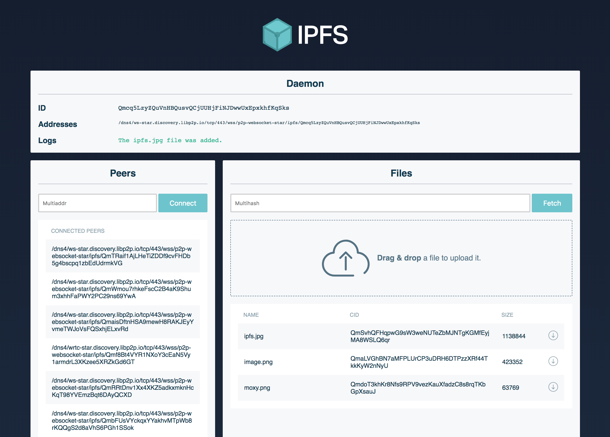
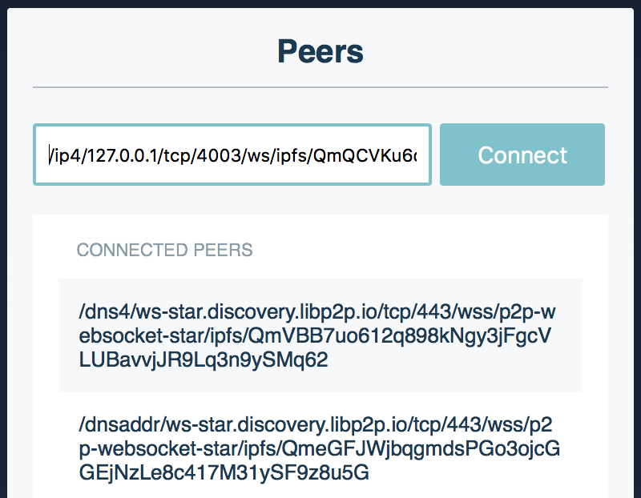
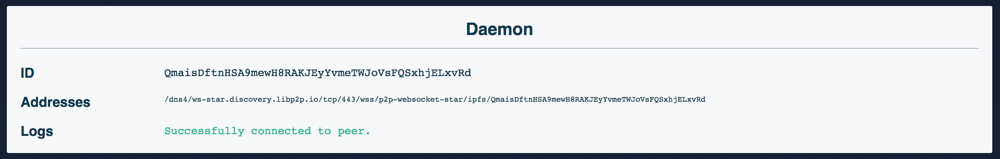
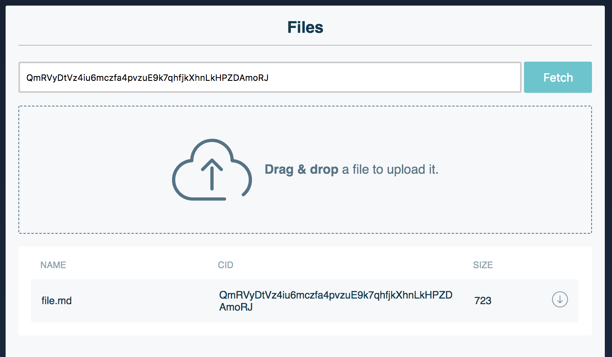
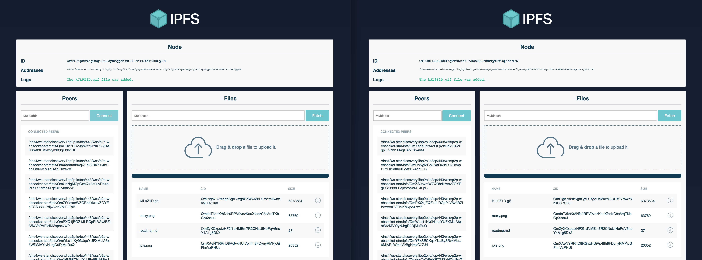

# Exchange files between the browser and other IPFS nodes

This tutorial will help you exchange files between browser nodes and go-ipfs or js-ipfs nodes!

**Note:** As `js-ipfs@0.29.0` currently doesn't support DHT peer discovery, the peer from which you are fetching data should be within the reach (local or in public IP) of the browser node.

That being said, we will explain how to circumvent these caveats and once they are fixed, we'll update the tutorial as well.

## Application diagram

The goal of this tutorial is to create a simple application with an IPFS node that dials to other instances using WebRTC, and at the same time dial and transfer files from a browser IPFS node using WebSockets as the transport.

```
┌──────────────┐                ┌──────────────┐
│   Browser    │ libp2p(WebRTC) │   Browser    │
│              │◀──────────────▶│              │
└──────────────┘                └──────────────┘
       ▲                                  ▲
       │WebSockets              WebSockets│
       │        ┌──────────────┐          │
       │        │   Desktop    │          │
       └───────▶│   Terminal   │◀─────────┘
                └──────────────┘
```

## Tutorial goal

The goal of this tutorial is for you to have something like this in the end:



## Step-by-step instructions

Here's what we are going to be doing:

1. Install a `go-ipfs` or `js-ipfs` node in your machine
2. Make your daemons listen on WebSockets
3. Start the app
4. Dial to a node using WebSockets (your desktop ones)
5. Transfer files between all of your nodes!

Just follow the instructions below and it will be up and running in no time!

### 1. Install `go-ipfs` or `js-ipfs`

If you already have `go-ipfs` or `js-ipfs` installed in your machine, you can skip this step. Otherwise, read on.

This tutorial works with either `go-ipfs` or `js-ipfs`, so you can install one of your choosing.

`go-ipfs` can be installed via its binary [here](https://ipfs.io/ipns/dist.ipfs.io/#go-ipfs). Alternatively, you can follow the install instructions in [ipfs/go-ipfs](https://github.com/ipfs/go-ipfs#install).

`js-ipfs` requires you to have [node and npm](https://www.npmjs.com/get-npm) installed. Then, you simply run:

```sh
> npm install --global ipfs
```

This will alias `jsipfs` on your machine; this is to avoid issues with `go-ipfs` being called `ipfs`.

At this point, you should have either `js-ipfs` or `go-ipfs` running. Now, initialize it:

```sh
> ipfs init
# or
> jsipfs init
```

This will set up an IPFS repo in your home directory.

### 2. Make your daemons listen on WebSockets

Now you need to edit your `config` file, the one you just set up with `{js}ipfs init`. It should be in either `~/.jsipfs/config` or `~/.ipfs/config`, depending on whether you're using JS or Go.

**Note:** `js-ipfs` sets up a websocket listener by default, so if you're using the JS implementation you can skip this and just start the daemon.

Since websockets support is currently not on by default, you'll need to add a WebSockets address manually. Look into your config file to find the `Addresses` section:

```json
"Addresses": {
  "Swarm": [
    "/ip4/0.0.0.0/tcp/4002"
  ],
  "API": "/ip4/127.0.0.1/tcp/5002",
  "Gateway": "/ip4/127.0.0.1/tcp/9090"
}
```

Add the `/ip4/127.0.0.1/tcp/9999/ws` entry to your `Swarm` array. Now it should look like this:

```json
"Addresses": {
  "Swarm": [
    "/ip4/0.0.0.0/tcp/4002",
    "/ip4/127.0.0.1/tcp/9999/ws"
  ],
  "API": "/ip4/127.0.0.1/tcp/5002",
  "Gateway": "/ip4/127.0.0.1/tcp/9090"
}
```

Save the file and it should be able to listen on Websockets. We're ready to start the daemon.

```sh
> ipfs daemon
# or
> jsipfs daemon
```

You should see the Websocket address in the output:

```sh
Initializing daemon...
Swarm listening on /ip4/127.0.0.1/tcp/4001
Swarm listening on /ip4/127.0.0.1/tcp/9999/ws
Swarm listening on /ip4/192.168.10.38/tcp/4001
Swarm listening on /ip4/192.168.10.38/tcp/9999/ws
API server listening on /ip4/127.0.0.1/tcp/5001
Gateway (readonly) server listening on /ip4/0.0.0.0/tcp/8080
Daemon is ready
```

Check the `/ws` in line 5, that means it is listening. Cool.

### 3. Start the app

Make sure you're in `js-ipfs/examples/exchange-files-in-browser`.

We'll need to install and bundle the dependencies to run the app. Let's do it:

```sh
> npm install
...
> npm run bundle
...
> npm start
```

You should see something like this if all went well:

```sh
Starting up http-server, serving public
Available on:
  http://127.0.0.1:12345
  http://192.168.2.92:12345
Hit CTRL-C to stop the server
```

Now go to http://127.0.0.1:12345 in a modern browser and you're on!

### 4. Dial to a node using WebSockets (your desktop ones)

Make sure you have a daemon running. If you don't, run:

```sh
> ipfs daemon
# or
> jsipfs daemon
```

Open another terminal window to find the websocket addresses that it is listening on:

```sh
> ipfs id
# or
> jsipfs id
```

It should look like this: `/ip4/127.0.0.1/tcp/9999/ws/ipfs/<your_peer_id>`.

Copy and paste the *multiaddr* to connect to that peer:



Check that you got connected:



### 5. Transfer files between all of your nodes!

Now you can add files through the CLI with:

```sh
> ipfs add <file>
# or
> jsipfs add <file>
```

Copy and paste the *multihash* and fetch the file in the browser!



You can also open two browser tabs, drag and drop files in one of them, and fetch them in the other!

But the coolest thing about this tutorial is `pubsub`! You can open two tabs that will share files through workspaces named after the url. Try opening two tabs with the following url:

```
http://127.0.0.1:12345/#file-exchange
# You can substitute `file-exchange` with anything you like, just make sure the two tabs are in the same workspace.
```

Now every file that you upload in one tab will appear in the other! You can even open a new tab in that workspace and it will sync the files that were added before!


