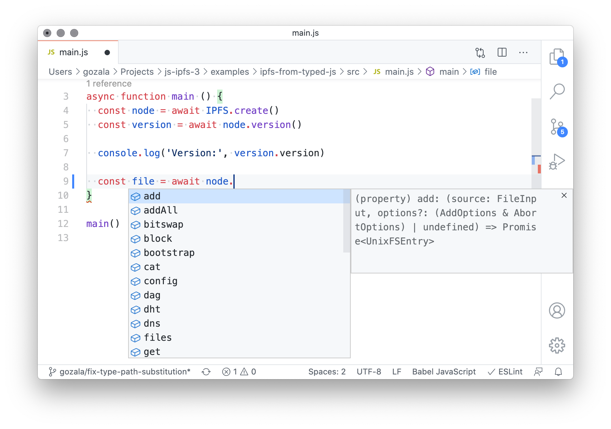

# Using IPFS with typed JS

> This example provides a template for setting up a [JS project that utilizes type checker](https://www.typescriptlang.org/docs/handbook/type-checking-javascript-files.html) and `js-ipfs` type [declarations the were generated from JSDoc comments](https://www.typescriptlang.org/docs/handbook/declaration-files/dts-from-js.html)

Things should work out of the box, only requirement is to disable
[`skipLibCheck`](https://www.typescriptlang.org/tsconfig#skipLibCheck) because type declarations generated by typescript for commonjs modules raise some issues when consumed.


## Before you start

First clone this repo, install dependencies in the project root.

```
git clone https://github.com/ipfs/js-ipfs.git
cd js-ipfs/examples/types-use-ipfs-from-typed-js
npm install
```

## Type checking

You can type check this example by runing following in the example directory:

```
npm test
```

You should see following output:

```
> tsc --noEmit
```

If you remove `// @ts-expect-error` comment is `src/main.js` on line 16 and run `npm test` once again you should see a following output instead:

```
> tsc --noEmit
src/main.js:16:14 - error TS2339: Property 'toUpperCase' does not exist on type 'CID'.

16     file.cid.toUpperCase()
                ~~~~~~~~~~~


Found 1 error.
```

## IntelliSense

In [VSCode](https://code.visualstudio.com/) and other code editors that provide [comparable IntelliSense features](https://docs.microsoft.com/en-us/visualstudio/ide/using-intellisense?view=vs-2019) you should be able to get code auto complete, parameter and return value information for `js-ipfs` APIs.



## Limitations

- Things should work out of the box, with most `tsconfig` settings, however unless
[`skipLibCheck`](https://www.typescriptlang.org/tsconfig#skipLibCheck) is set to `true` many errors will be reported.
  > That is because
types are generated from source JSDoc comments and typescript seems to emit declarations which it then complains about.

- Not all APIs are fully entyped so you might observe gaps and `any` types here and there. We hope to improve this over time.
