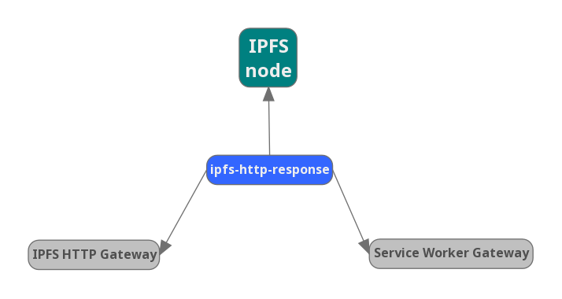

# js-ipfs-http-response

[](http://protocol.ai)
[](http://ipfs.io/)
[](http://webchat.freenode.net/?channels=%23ipfs)
[](https://github.com/RichardLitt/standard-readme)
[](https://github.com/feross/standard)

> Creates an HTTP response from an IPFS Hash

### Installation

> npm install ipfs-http-response

## Usage


### Creating HTTP Response

This project creates a HTTP response for an IPFS Path. This response can be a file, a HTML with directory listing or the entry point of a web page.

```js
import { getResponse } from 'ipfs-http-response'

const result = await getResponse(ipfsNode, ipfsPath)
console.log(result)
```

### Using protocol-agnostic resolver

This module also exports the used ipfs `resolver`, which should be used when the response needs to be customized or non-HTTP transport is used:

```js
import { resolver } from 'ipfs-http-response'

const result = await resolver.cid(ipfsNode, ipfsPath)
console.log(result)
```

If `ipfsPath` points at a directory, `resolver.cid` will throw Error `This dag node is a directory` with a `cid` attribute that can be passed to `resolver.directory`:


```js
import { resolver } from 'ipfs-http-response'

const result = await resolver.directory(ipfsNode, ipfsPath, cid)
console.log(result)
```

`result` will be either a `string` with HTML directory listing or an array with CIDs of `index` pages present in inspected directory.


